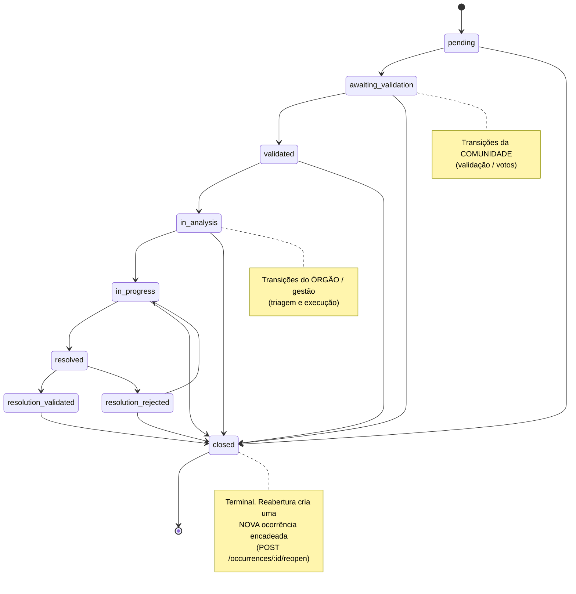

# 1. Regras de Negócio

> **Como ler.** Cada regra tem identificador (`RN-xx`), descrição, gatilho, comportamento e a
> referência ao código que a implementa **no front**. A **fonte da verdade** das regras é o
> backend ProjetoZup; aqui registramos como o front as **reflete, impõe na UI e consome via API**.
> Pontos cuja validação real mora no servidor estão marcados com `> ⚠️ A confirmar:`.

## Índice de regras

| ID | Regra | Onde vive (front) |
|----|-------|-------------------|
| RN-01 | Escopo municipal fixo (Videira/SC) | `src/data/mockData.ts` |
| RN-02 | Geofencing — bairro pela coordenada | `src/lib/neighborhoods-api.ts` |
| RN-03 | Prevenção de duplicidade por raio | `src/lib/occurrences-api.ts`, `CreateReportModal.tsx` |
| RN-04 | Pré-visualização de ocorrências próximas | `CreateReportModal.tsx` |
| RN-05 | Máquina de estados da ocorrência (9 status) | `src/data/mockData.ts` |
| RN-06 | Transições restritas + 409 | `StatusControl.tsx`, `useOccurrences.ts` |
| RN-07 | Validação comunitária (estados + votos) | `src/lib/evaluations-api.ts` |
| RN-08 | Reincidência e reabertura | `src/lib/occurrences-api.ts`, `StatusControl.tsx` |
| RN-09 | Votação/priorização | `src/lib/evaluations-api.ts` |
| RN-10 | Janela de edição/exclusão pós-registro | `CreateReportModal.tsx` (texto da UI) |
| RN-11 | Mídia obrigatória no registro | `CreateReportModal.tsx` |
| RN-12 | Órgão responsável (atribuição real + derivação legada) | `mockData.ts`, `useTaxonomy.ts` |
| RN-13 | Identidade do cidadão / anonimato | `auth-api.ts`, `CreateReportModal.tsx` |
| RN-14 | Integridade referencial de bairros | contrato (`neighborhood_id`) |
| RN-15 | Validação de CPF na entrada | `src/lib/validators.ts` |

---

## RN-01 — Escopo municipal fixo (Videira/SC)

- **Descrição.** Todo o sistema opera dentro do município de **Videira/SC**. O município é escopo
  fixo do projeto, **não** um dado de banco.
- **Comportamento.** O mapa centraliza em `[-27.0078, -51.1519]` (zoom 14) e os textos da UI
  ("Registrar Ocorrência em Videira/SC") reforçam o escopo.
- **Código.** `currentMunicipality` em `src/data/mockData.ts:151`.

## RN-02 — Geofencing: bairro resolvido pela coordenada

- **Descrição.** Uma ocorrência é amarrada a um **bairro de Videira**. O front não usa
  autocomplete de endereço: o usuário marca o ponto no mapa e o **bairro é descoberto pela
  coordenada**.
- **Gatilho.** Clique no mapa em `CreateReportModal` → `handleMapClick` → `detectNeighborhood`.
- **Comportamento.** Chamada `GET /api/neighborhoods/locate?lat=&lng=`. O backend resolve via
  PostGIS (`ST_Contains`) qual polígono de bairro contém o ponto. Retorno `null` (404 ou rede)
  significa "ponto fora dos bairros" — o campo de bairro fica vazio para o usuário corrigir.
- **Código.** `locateNeighborhood()` em `src/lib/neighborhoods-api.ts:73`.
- **Contorno dos bairros.** O mapa desenha o polígono real de cada bairro (GeoJSON `boundary`),
  obtido em `GET /api/neighborhoods/:id` (a listagem não traz geometria).
  Ver `listNeighborhoodBoundaries()` em `neighborhoods-api.ts:53`.

> ⚠️ A confirmar: a **rejeição de pontos fora do município** (bloqueio duro) é responsabilidade do
> backend ao criar a ocorrência. O front apenas deixa de resolver bairro; confirmar se o `POST
> /occurrences` recusa coordenadas fora de Videira.

## RN-03 — Prevenção de duplicidade por raio

- **Descrição.** Antes de aceitar uma nova ocorrência, o sistema impede **duplicatas próximas**.
- **Comportamento (front).** Na criação (`POST /api/occurrences`), o backend pode responder
  **HTTP 409** com `details: { duplicate_id, distance_m }`. O front trata esse 409 mostrando ao
  usuário que já existe ocorrência aberta semelhante e a que distância (`#id` e `~Xm`).
- **Raios definidos no front.** `DUPLICATE_RADIUS_METERS = 7` (raio de bloqueio por duplicidade,
  exibido ao usuário) e `NEARBY_RADIUS_METERS = 500` (raio de aviso/pré-visualização).
  Ver `src/data/mockData.ts:123-124`.
- **Código.** Tratamento do 409 em `CreateReportModal.tsx:159`.

> ⚠️ A confirmar: o **valor do raio de bloqueio** efetivo é do backend (`ST_DWithin` sobre
> `geography`). O `7m` do front é o número exibido na UI; confirmar se coincide com o do backend e
> qual o critério **bloqueio (409)** vs. **apenas aviso**.

## RN-04 — Pré-visualização de ocorrências próximas

- **Descrição.** Ao marcar o ponto, o usuário vê quantas ocorrências já existem por perto, para
  evitar registro duplicado consciente.
- **Comportamento.** `GET /api/occurrences/nearby?lat=&lng=&radius=500` retorna ocorrências no raio
  (ordenadas por distância), renderizadas no mini-mapa do passo 1 com um aviso
  ("N ocorrência(s) num raio de 500m").
- **Código.** `listNearbyOccurrences()` em `occurrences-api.ts:256`; uso em `CreateReportModal.tsx:55`.

## RN-05 — Máquina de estados da ocorrência (9 status)

- **Descrição.** A ocorrência percorre um ciclo de vida com **9 estados** que distinguem a
  **validação da comunidade** do **tratamento formal pelo órgão**.
- **Estados** (`ReportStatus`, `statusLabels` em `mockData.ts`):

  | Status (API) | Rótulo (UI) | Natureza |
  |--------------|-------------|----------|
  | `pending` | Pendente | inicial |
  | `awaiting_validation` | Aguardando Validação | comunidade |
  | `validated` | Validada pela Comunidade | comunidade |
  | `in_analysis` | Em Análise | órgão |
  | `in_progress` | Em Execução | órgão |
  | `resolved` | Resolvido pelo Órgão | órgão |
  | `resolution_validated` | Resolução Validada | comunidade |
  | `resolution_rejected` | Resolução Rejeitada | comunidade |
  | `closed` | Encerrada | terminal |

- **Transições permitidas** (`STATUS_TRANSITIONS` em `mockData.ts:228` — espelho exato do
  `occurrencesService.js` do backend):

  | De | Para |
  |----|------|
  | `pending` | `awaiting_validation`, `closed` |
  | `awaiting_validation` | `validated`, `closed` |
  | `validated` | `in_analysis`, `closed` |
  | `in_analysis` | `in_progress`, `closed` |
  | `in_progress` | `resolved`, `closed` |
  | `resolved` | `resolution_validated`, `resolution_rejected` |
  | `resolution_rejected` | `in_progress`, `closed` |
  | `resolution_validated` | `closed` |
  | `closed` | — (terminal) |

### Diagrama de estados

- **Quem dispara.** Pela lógica do front, os estados de **validação/resolução validada/rejeitada**
  pertencem à comunidade e os estados **em análise / em execução / resolvido** ao órgão. A UI de
  mudança de status (`StatusControl`) só é exibida para perfis institucionais.

> ⚠️ A confirmar: a **autorização real** por estado é do backend. Hoje a rota `PATCH
> /occurrences/:id/status` **não tem `requireRole`** (comentado em `StatusControl.tsx:8`): qualquer
> autenticado consegue mudar status pela API. O gating do front é **apenas cosmético** — a
> restrição precisa ser feita no backend.

## RN-06 — Transições restritas e resposta 409

- **Descrição.** Só são oferecidas as transições válidas a partir do estado atual; transição
  inválida é rejeitada.
- **Comportamento.** `nextStatuses(status)` alimenta o menu de "Avançar para". Se ainda assim uma
  transição inválida chegar ao backend, ele responde **409** com `details: { from, to, allowed }`,
  e o front mostra um toast "Transição não permitida".
- **Código.** `StatusControl.tsx:84` (tratamento do 409); `useUpdateOccurrenceStatus` em
  `useOccurrences.ts:66`.

## RN-07 — Validação comunitária

- **Descrição.** Uma ocorrência passa por **confirmação da comunidade** (estados
  `awaiting_validation` → `validated`) antes de avançar ao tratamento do órgão. O engajamento é
  registrado por **votos** (avaliações).
- **Comportamento (front).** Avaliações via `evaluations-api`:
  - `POST /occurrences/:id/upvote` — voto a favor (confirma);
  - `POST /occurrences/:id/downvote` — voto contra;
  - `DELETE /occurrences/:id/vote` — remove o voto;
  - `GET /occurrences/:id/evaluations` — lista de votos.
  - Ocorrências `closed` **não** aceitam voto (409).
- **Código.** `src/lib/evaluations-api.ts`.

> ⚠️ A confirmar (regra de servidor): o **critério de elegibilidade** do validador (mesmo
> bairro/região), **quantos votos/confirmações** promovem `awaiting_validation → validated`, e o
> **algoritmo de seleção de validadores** (base por bairro, adjacência via
> `neighborhood_adjacency`) **não são implementados no front** — são regras do backend. O front
> apenas envia votos e exibe os estados resultantes. O contrato visível ao front **não expõe**
> adjacência de bairros (a geometria vem só no `GET /neighborhoods/:id`, sem adjacência).

## RN-08 — Reincidência e reabertura

- **Descrição.** Um problema **encerrado/resolvido** que volta a ocorrer é **reaberto**, criando
  uma **nova ocorrência encadeada** (reincidência) ligada à original.
- **Gatilho.** Em estado terminal (`closed`), `StatusControl` oferece "Reabrir" (exige motivo,
  mínimo 5 caracteres).
- **Comportamento.** `POST /api/occurrences/:id/reopen` com `{ reason }`. O backend cria a nova
  ocorrência e preenche o encadeamento: `reopen_count`, `parent_occurrence_id`,
  `root_occurrence_id`. O front marca `isRecurrence` quando `reopen_count > 0` ou há
  `parent_occurrence_id`.
- **Código.** `reopenOccurrence()` em `occurrences-api.ts:242`; `mapOccurrenceToReport` (campos de
  reincidência) em `occurrences-api.ts:124`; UI de reabertura em `StatusControl.tsx:135`.
- **Tabela de reaberturas (contrato).** `GET /occurrences/:id/reopens` → `BackendReopen[]`
  (`original_occurrence_id`, `new_occurrence_id`, `root_occurrence_id`, `reason`,
  `previous_status`, `reopen_sequence`).

## RN-09 — Votação / priorização

- **Descrição.** A votação comunitária (upvote/downvote → `score`) sinaliza a relevância da
  demanda.
- **Comportamento (front).** O front exibe `upvotes`, `downvotes` e `score` vindos do backend e os
  agrega em estatísticas (`useValidationStats`).
- **Código.** `evaluations-api.ts`; `score`/`upvotes`/`downvotes` em `mapOccurrenceToReport`.

> ⚠️ A confirmar: a **priorização efetiva** das demandas a partir dos votos é regra de negócio do
> backend. **O campo `priority` não existe no backend** hoje (stand-by): o front fixa
> `priority: "media"` em todo `Report` (`occurrences-api.ts:133`) e mantém o enum `Priority`
> (`baixa|media|alta|critica`) apenas como estrutura de UI. Não há, no front, cálculo de
> prioridade a partir de votos.

## RN-10 — Janela de edição/exclusão pós-registro

- **Descrição.** Após registrar, o autor tem uma **janela de tempo** para editar ou excluir a
  própria ocorrência.
- **Comportamento (front).** A UI informa explicitamente: *"Você tem 24h para editar ou excluir a
  ocorrência após o registro."* (toast de sucesso e tela de revisão).
- **Código.** `CreateReportModal.tsx:154` e `:407`. Operações: `updateOccurrence` /
  `deleteOccurrence` (`occurrences-api.ts:213,227`).

> ⚠️ A confirmar: a **duração e o enforcement** da janela (ex.: 24h vs. 12h) são impostos pelo
> backend. O front apenas **comunica** o prazo na UI — não há constante de janela nem checagem de
> tempo no código do front. Confirmar o valor real e onde é validado.

## RN-11 — Mídia obrigatória no registro

- **Descrição.** O registro exige **ao menos uma foto** (até 5) do problema.
- **Comportamento.** O passo 2 do formulário só avança com `imagePreviews.length > 0`
  (`canProceedStep2`). A primeira imagem é a "principal". Upload via `POST
  /occurrences/:id/media` (multipart, campo `media`), após criar a ocorrência.
- **Código.** `CreateReportModal.tsx:177`; `uploadOccurrenceMedia()` em `occurrences-api.ts:180`.
- **Resiliência.** Se o upload falhar, a ocorrência **não é perdida**: o front avisa que as fotos
  não subiram e sugere reenvio em "Meu Painel".

## RN-12 — Órgão responsável

- **Descrição.** Cada ocorrência é tratada por um **órgão**. Existem dois mecanismos:
  1. **Atribuição real (autoritativa):** `assigned_organization_id` na ocorrência (nulo até a
     triagem atribuir). Os órgãos vêm de `GET /api/organizations` (somente leitura).
  2. **Derivação legada (hardcoded):** quando não há atribuição, o front deriva um órgão a partir
     do **slug da categoria** (`CATEGORY_ORGAN_MAP`): água/saneamento/esgoto → `agua_saneamento`,
     energia/iluminação/elétrica → `energia_luz`, demais → `prefeitura`.
- **Órgãos do escopo:** Prefeitura Municipal, **VISAN** (Água e Saneamento), **CELESC** (Energia e
  Iluminação) — ver `src/data/organConfig.ts`.
- **Código.** `CATEGORY_ORGAN_MAP`/`categoryOrganBySlug` em `mockData.ts:162`; órgãos reais em
  `useTaxonomy.ts` (`organizationName`, "Não atribuído" quando nulo).

> ⚠️ A confirmar: o backend **não vincula** agente→organização nem categoria→organização. A
> derivação por slug é **legado/cosmético** até esse vínculo existir.

## RN-13 — Identidade do cidadão e anonimato

- **Descrição.** O cidadão se autentica por **CPF + senha**; a UI comunica **anonimato** na
  publicação ("Sua identidade é protegida").
- **Código.** Login por CPF em `auth-api.ts:45`; aviso de anonimato em `CreateReportModal.tsx:391`.

> ⚠️ A confirmar: o contrato atual **não** envia flag `is_anonymous` na criação (removida — item 23
> do histórico de adequação). O grau real de anonimato/privacidade é definido pelo backend.

## RN-14 — Integridade referencial de bairros

- **Descrição.** A ocorrência referencia o bairro por `neighborhood_id`. Reimportações da malha de
  bairros precisam ser **aditivas** para não órfãs as ocorrências.
- **Reflexo no front.** O front tolera `neighborhood_id` nulo (campo opcional em `Report`,
  resolvido para nome pela taxonomia; cai em vazio quando ausente).

> ⚠️ A confirmar (decisão de banco): comportamento de FK `ON DELETE SET NULL` em `neighborhood_id`
> e a recomendação de **reimportar bairros de forma aditiva** são regras do backend/banco. Ver
> [07-modelo-de-dados.md](07-modelo-de-dados.md).

## RN-15 — Validação de CPF na entrada

- **Descrição.** CPF é validado no cliente (formato + dígitos verificadores) antes do envio; o
  envio normaliza para 11 dígitos (sem máscara).
- **Código.** `validateCPF`/`formatCPF` em `src/lib/validators.ts`; normalização no login/cadastro
  (`auth-api.ts`).
