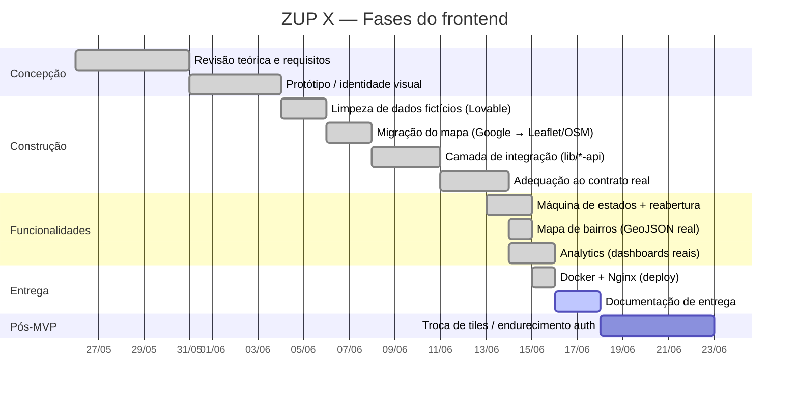

# 3. Plano de Projeto

> Planejamento e andamento do **frontend ZUP X**. O estado atual reflete o código deste repositório
> e o histórico de adequação do front ao contrato real do backend ProjetoZup.

## 3.1 Escopo e objetivos

**Objetivo geral.** Entregar a interface web da plataforma ZUP para o município de **Videira/SC**,
permitindo ao cidadão registrar e acompanhar problemas urbanos georreferenciados e à gestão pública
tratá-los com transparência.

**Objetivos específicos.**
- Mapa interativo (Leaflet/OSM) com ocorrências, contorno de bairros e mapa de calor.
- Registro guiado de ocorrência com geolocalização, mídia e detecção de bairro por coordenada.
- Acompanhamento de status pela máquina de estados real (9 estados) e reabertura.
- Validação/avaliação comunitária (votos) e painéis por perfil.
- Dashboards analíticos consumindo os endpoints de transparência do backend.
- Camada de integração desacoplada e configurável por ambiente.

**Fora de escopo (deste repositório).** Implementação das regras de negócio servidor-side
(geofencing, duplicidade, elegibilidade de validadores, autorização por papel) — pertencem ao
backend ProjetoZup.

## 3.2 Cronograma / fases

> ⚠️ A confirmar: as **datas** acima foram derivadas do histórico de commits (`first commit`,
> `Docker compose + nginx`, etc.) e do estado do código em 2026-06-16. Ajuste conforme o
> cronograma oficial do trabalho.

## 3.3 Marcos (milestones) e entregáveis

| Marco | Entregável | Status |
|-------|-----------|--------|
| M1 — Base limpa | Front sem dados fictícios; modelo de domínio isolado em `mockData.ts` | ✅ Concluído |
| M2 — Mapa aberto | Mapa em Leaflet/OSM, sem dependência do Google Maps | ✅ Concluído |
| M3 — Integração | `src/lib/*-api.ts` + hooks consumindo a API real | ✅ Concluído |
| M4 — Contrato | GeoJSON `[lng,lat]`, ids numéricos, taxonomia viva, mídia multipart | ✅ Concluído |
| M5 — Estados | Máquina de 9 estados, transições/409, reabertura | ✅ Concluído |
| M6 — Bairros reais | Contorno por GeoJSON real e geocoding via `/neighborhoods/locate` | ✅ Concluído |
| M7 — Analytics | Dashboards consumindo `/analytics/*` reais | ✅ Concluído |
| M8 — Deploy | Dockerfile multi-stage + Nginx (proxy `/api` + SPA fallback) | ✅ Concluído |
| M9 — Documentação | Pasta `docs/` para avaliação | 🟡 Em andamento |

## 3.4 Estado atual

**Pronto.**
- Limpeza do front e modelo de domínio isolado.
- Mapa Leaflet/OSM, heatmap, contorno real de bairros.
- Camada de integração completa por domínio (`auth`, `occurrences`, `categories`,
  `organizations`, `neighborhoods`, `evaluations`, `analytics`).
- Autenticação CPF + JWT com refresh automático; rotas protegidas.
- Máquina de estados (9), transições/409, reabertura/reincidência.
- Taxonomia viva (categorias/subcategorias/bairros/órgãos via API).
- Dashboards analíticos reais (`/analytics/*`).
- Deploy via Docker/Nginx.

**Em andamento / pendências conhecidas.**
- **Documentação de entrega** (esta pasta).
- **Notificações** — sem endpoint consumido (placeholder na UI).
- **Prioridade** — `priority` não existe no backend; front fixa `media` (stand-by).
- **Suporte (contato)** — formulário de contato com integração a confirmar.

## 3.5 Roadmap / backlog

1. **Troca do provedor de tiles** (MapTiler/Stadia/Carto/self-host) antes de produção (RNF-11).
2. **Endurecimento da autorização** no backend (`requireRole` em `PATCH .../status` e demais) —
   hoje o gating do front é cosmético.
3. **Vínculo agente→organização** no backend, eliminando a derivação legada por slug.
4. **Módulo de notificações** (endpoint + consumo no front).
5. **Definição de prioridade** (se entrar no escopo) — campo no backend e regra de votação.
6. **Migrations versionadas / seed reprodutível** (lado backend) e **pipeline CI/CD**.

## 3.6 Gestão de versão

- Repositório no **GitHub**; branch principal `main`.
- Pontos de plugagem futura marcados no código com `TODO(API)`.
- Recomenda-se **PRs com keywords de fechamento de issue** (`Closes #...`) e revisão por par.

> ⚠️ A confirmar: o fluxo de branches/PRs efetivo (trunk-based, GitFlow etc.) deve ser preenchido
> conforme a prática da equipe.

## 3.7 Equipe e responsabilidades

| Frente | Responsabilidade |
|--------|------------------|
| Frontend (este repo) | UI, mapa, integração com a API, painéis e dashboards |
| Backend (ProjetoZup) | Regras de negócio, PostGIS, autenticação, OpenAPI — **fonte da verdade** |

> ⚠️ A confirmar: nomes/divisão da equipe a preencher pelo autor.
