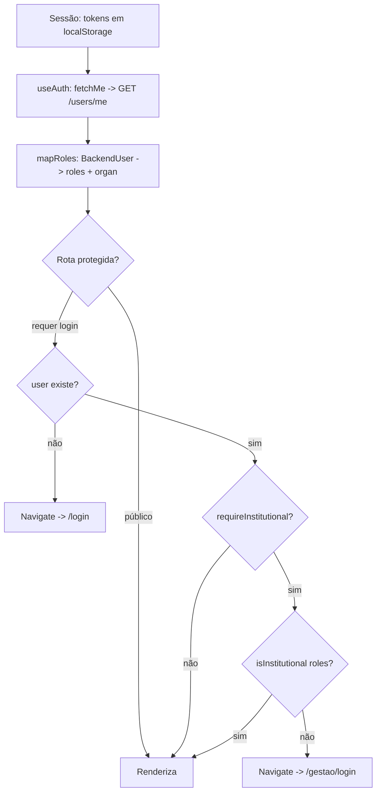

# 4. Perfis e Permissões

> Papéis do sistema e o que cada um pode fazer **na visão do front**. A autorização **definitiva**
> é do backend; aqui descrevemos os papéis, o mapeamento back↔front e como o front aplica o
> controle de acesso no cliente.

## 4.1 Papéis

### No backend (MVP)
O backend trabalha com **3 papéis**: `citizen`, `agent`, `admin`
(`BackendRole` em `src/lib/auth-api.ts:7`).

### No front (modelo de UI)
O front trabalha com **5 papéis** (`AppRole` em `src/hooks/useAuth.tsx:5`):
`cidadao`, `prefeitura`, `agua_saneamento`, `energia_luz`, `admin`.

### Mapeamento back → front (`mapRoles`, `auth-api.ts:38`)

| Papel backend | Papéis front | `organ` |
|---------------|--------------|---------|
| `admin` | `admin` | — |
| `agent` | `prefeitura` | `prefeitura` |
| `citizen` | `cidadao` | — |

> ⚠️ A confirmar: o backend **não** diz a qual órgão um `agent` pertence (sem vínculo
> agente→organização). Por isso **todo `agent` cai em `prefeitura`** por padrão. Os papéis
> `agua_saneamento`/`energia_luz` existem no modelo do front, mas hoje **nenhum usuário real é
> mapeado para eles** — dependem de o backend expor o órgão do agente.

### Descrição dos perfis

- **Cidadão (`cidadao`).** Registra ocorrências, anexa mídia, vê próximas, vota (up/down),
  acompanha status e histórico, edita/exclui as próprias (janela informada), reabre via fluxo
  comunitário. É o papel base.
- **Validador (cidadão elegível).** **Não é um papel separado no contrato atual.** A "validação
  comunitária" acontece via **votos** de cidadãos e pelos estados `awaiting_validation`/`validated`.
  A elegibilidade (mesmo bairro/região) é regra do backend.
  > ⚠️ A confirmar: não há, no front, papel ou flag de "validador". Se o backend promover cidadãos
  > a validadores, esse critério precisa ser exposto e refletido aqui.
- **Órgão / Gestão (`prefeitura`, `agua_saneamento`, `energia_luz`).** Perfis **institucionais**:
  acessam painéis de gestão, alteram status operacional, reabrem ocorrências e veem dashboards.
- **Administrador (`admin`).** Institucional com acesso total na UI; adicionalmente lista usuários
  (`GET /users`).

**Agrupamento "institucional".** `isInstitutional(roles)` = qualquer um de `prefeitura`,
`agua_saneamento`, `energia_luz`, `admin` (`useAuth.tsx:83`). É o que libera as rotas internas e os
controles de gestão.

## 4.2 Matriz Perfil × Ação

> ✓ = liberado na UI · ✗ = oculto/bloqueado na UI · ⚠️ = gating apenas cosmético (não restringido
> no backend hoje)

| Ação | Cidadão | Órgão (prefeitura/água/energia) | Admin |
|------|:------:|:------:|:-----:|
| Registrar ocorrência | ✓ | ✓ | ✓ |
| Anexar mídia | ✓ | ✓ | ✓ |
| Ver ocorrências próximas (nearby) | ✓ | ✓ | ✓ |
| Votar (up/down) / remover voto | ✓ | ✓ | ✓ |
| Acompanhar status + histórico | ✓ | ✓ | ✓ |
| Editar/excluir **a própria** ocorrência | ✓ (autor) | ✓ (autor) | ✓ |
| Alterar status operacional | ✗ ⚠️ | ✓ ⚠️ | ✓ ⚠️ |
| Reabrir ocorrência (reincidência) | ✗ ⚠️ | ✓ ⚠️ | ✓ ⚠️ |
| Acessar painel de gestão / institucional | ✗ | ✓ | ✓ |
| Acessar dashboards de gestão | ✗ | ✓ | ✓ |
| Estatística por órgão (`/analytics/by-organization`) | ✗ | ✓ (auth) | ✓ (auth) |
| Listar usuários (`GET /users`) | ✗ | ✗ | ✓ |

**Notas da matriz.**
- A coluna "Validador" foi omitida de propósito: validação é por **voto de cidadão**, não papel
  (ver 4.1).
- O ⚠️ em "Alterar status"/"Reabrir" indica que o controle é **escondido** no front para
  não-institucionais (`StatusControl` retorna `null` — `StatusControl.tsx:69`), mas a rota
  `PATCH /occurrences/:id/status` **não** restringe papel no backend hoje. **A restrição real
  precisa ser feita no backend.**

## 4.3 Como a autorização é aplicada (no front)

- **Sessão.** Tokens (`zup_access_token`, `zup_refresh_token`) em `localStorage`; toda chamada
  autenticada injeta `Authorization: Bearer` e renova em 401 (`src/lib/api.ts`).
- **Contexto de auth.** `AuthProvider`/`useAuth` carrega `users/me`, deriva `roles`/`organ` e
  expõe `signOut`/`refreshRoles` (`src/hooks/useAuth.tsx`).
- **Guarda de rota.** `ProtectedRoute` (`src/components/ProtectedRoute.tsx`):
  - sem `user` → redireciona para `/login`;
  - `requireInstitutional` e não institucional → redireciona para `/gestao/login`.
- **Gating de ação.** Componentes sensíveis checam o papel (ex.: `StatusControl` só renderiza para
  institucionais).

## 4.4 Critério de elegibilidade do validador

> ⚠️ A confirmar: a promoção de um cidadão a **validador elegível** (ex.: residir no mesmo bairro /
> região da ocorrência, possivelmente via `neighborhood_adjacency`) é **regra do backend** e **não
> está implementada nem exposta ao front**. O front associa o usuário a um bairro
> (`neighborhood_id` no cadastro/perfil), o que pode servir de base para essa regra no servidor.
