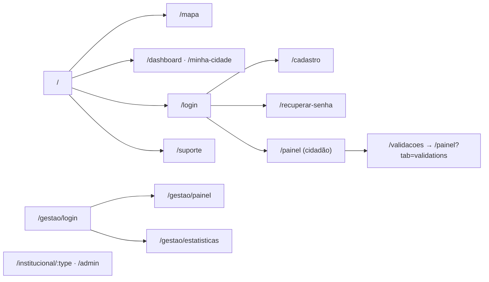

# 6. Documentação Técnica do Frontend

Esta seção descreve o frontend ZUP X por dentro — estrutura de código, telas e, em especial, a
camada visual (identidade, design system e UX). As regras de negócio e os requisitos têm tratamento
próprio em [01-regras-de-negocio.md](01-regras-de-negocio.md) e [02-requisitos.md](02-requisitos.md),
e são definidos pela API ProjetoZup que a aplicação consome.

## 6.1 Stack

- **React 18** + **TypeScript** + **Vite 5** (`@vitejs/plugin-react-swc`).
- **React Router** (`react-router-dom`) — rotas; **TanStack Query** (`@tanstack/react-query`) —
  cache e estado de servidor.
- **Tailwind CSS** + **shadcn/ui** (componentes sobre **Radix UI**) + **lucide-react** (ícones) +
  **framer-motion** (animações).
- **Leaflet** + **react-leaflet** + **leaflet.heat** — mapa e mapa de calor.
- **react-hook-form** + **zod** — formulários e validação.
- **Recharts** — gráficos; **sonner** — toasts; **react-helmet-async** — SEO.
- **Plus Jakarta Sans** — tipografia base (fonte da identidade).
- Build/deploy via **Docker** (`Dockerfile`, `nginx.conf`, `docker-compose.yml`).

## 6.2 Estrutura do projeto

```
src/
├── main.tsx            # Bootstrap (HelmetProvider) + CSS do Leaflet
├── App.tsx             # Providers (QueryClient, Theme, Tooltip, Auth) e rotas
├── index.css           # Tokens de tema (CSS variables) — paleta clara/escura
├── pages/              # Uma página por rota (Index, MapPage, Dashboard, Login, Gestao…)
├── components/         # Componentes de domínio (MapView, ReportCard, StatusControl…)
│   ├── ui/             # Primitivos do shadcn/ui (Radix) — design system (49 arquivos)
│   ├── layout/         # Navbar / casca da aplicação
│   └── support/        # Suporte/FAQ (FAB, formulário, footer)
├── hooks/              # useAuth, useOccurrences, useStats, useTaxonomy, useTheme…
├── lib/                # Cliente HTTP e módulos de API (auth, occurrences, analytics…)
├── data/               # Tipos e configs de domínio (status, órgãos, FAQ)
├── assets/             # Imagens estáticas
└── vendor/leaflet/     # CSS do Leaflet vendorizado (sem dependência de CDN)
```

## 6.3 Estrutura de componentes

| Grupo | Componentes | Papel |
|-------|-------------|-------|
| Mapa | `MapView`, `MapLegend`, `useNeighborhoodBoundaries` | Mapa Leaflet, legenda por status, contorno de bairros |
| Registro/Detalhe | `CreateReportModal`, `ReportDetailModal`, `ReportCard`, `ReportImage` | Fluxo de registro (4 passos), detalhe, listagem |
| Status | `StatusControl`, `StatusBadge`, `PriorityBadge` | Mudança de status/reabertura e selos |
| Layout/navegação | `layout/Navbar`, `NavLink`, `HeroCarousel`, `OnboardingModal`, `Seo` | Casca da aplicação |
| Acesso | `ProtectedRoute` | Guarda de rotas |
| Suporte | `support/ContactForm`, `ContactInfo`, `FaqAccordion`, `SupportFab`, `SupportFooter` | Suporte/FAQ |
| Robustez | `ErrorBoundary` | Captura de erros de render |
| **UI base** | `components/ui/*` | **Reutilizáveis** (shadcn/ui sobre Radix): button, dialog, select, table, tabs, toast, etc. |

Os componentes em `components/ui/` são a **biblioteca reutilizável** (design system) e não contêm
regra de negócio.

## 6.4 Mapa de navegação / rotas

Definidas em `src/App.tsx`. Rotas protegidas passam por `ProtectedRoute` (exige sessão;
`requireInstitutional` restringe a perfis institucionais — ver [04-perfis-e-permissoes.md](04-perfis-e-permissoes.md)).

| Rota | Página | Acesso |
|------|--------|--------|
| `/` | `Index` (landing) | Público |
| `/mapa` | `MapPage` | Público |
| `/dashboard`, `/minha-cidade` | `Dashboard` | Público |
| `/login`, `/cadastro`, `/recuperar-senha` | `Login`/`Register`/`ForgotPassword` | Público |
| `/painel` | `CitizenPanel` | Autenticado |
| `/validacoes` | → redireciona para `/painel?tab=validations` | Autenticado |
| `/institucional/:type`, `/admin` | `InstitutionalPanel`/`AdminPanel` | Institucional |
| `/gestao/login` | `GestaoLogin` | Público |
| `/gestao` | `Gestao` | Público (entrada) |
| `/gestao/painel`, `/gestao/estatisticas` | `GestaoPanel`/`GestaoEstatisticas` | Institucional |
| `/suporte` | `Support` | Público |
| `*` | `NotFound` | — |



> O **detalhe** e o **registro** de ocorrência são abertos como **modais** (`ReportDetailModal`,
> `CreateReportModal`) sobre o mapa — não como rotas próprias.

## 6.5 Gestão de estado e fluxo de dados

- **Estado de servidor:** **TanStack Query** é a fonte. Hooks por domínio
  (`useOccurrences`, `useTaxonomy`, `useStats`, `useNeighborhoodBoundaries`,
  `useSupportContact`) encapsulam `useQuery`/`useMutation` e entregam um **shape estável** à UI.
- **Mapeamento contrato → UI:** `mapOccurrenceToReport` converte `BackendOccurrence` em `Report`;
  `useOccurrences` enriquece com nome do bairro (taxonomia) e órgão derivado.
- **Invalidação:** mutações de status/reabertura invalidam `occurrences`, `occurrence-detail`,
  `status-history` e os recortes `analytics-*` (`useOccurrences.ts:53`).
- **Estado de autenticação:** Context `AuthProvider`/`useAuth` (usuário, papéis, órgão) sincronizado
  entre abas via evento `storage`.
- **Estado de UI local:** `useState` nos formulários (ex.: `CreateReportModal` controla passo,
  posição, arquivos) e `useTheme` para tema claro/escuro.

## 6.6 Integração com a API (cliente)

- **Centralizada** em `src/lib/api.ts` (ver [05-backend-contrato.md](05-backend-contrato.md)).
- **Tratamento de erro:** `ApiError` com `status`/`data`. Padrões na UI:
  - **409 duplicidade** → toast "Ocorrência semelhante já existe" (`CreateReportModal`).
  - **409 transição inválida** → toast "Transição não permitida" (`StatusControl`).
  - Falha de upload de mídia → ocorrência preservada, aviso para reenviar.
- **Auth no cliente:** Bearer + refresh automático; tokens em `localStorage`
  (`zup_access_token`/`zup_refresh_token`).

### Rótulos de status exibidos na UI

`statusLabels` em `mockData.ts` traduz os **9 status reais** da máquina de estados do back:

| Status (API) | Rótulo na UI |
|--------------|--------------|
| `pending` | Pendente |
| `awaiting_validation` | Aguardando Validação |
| `validated` | Validada pela Comunidade |
| `in_analysis` | Em Análise |
| `in_progress` | Em Execução |
| `resolved` | Resolvido pelo Órgão |
| `resolution_validated` | Resolução Validada |
| `resolution_rejected` | Resolução Rejeitada |
| `closed` | Encerrada |

## 6.7 Camada de mapa (Leaflet/OSM)

- **Tiles:** servidor público do OpenStreetMap (`OSM_URL` em `MapView.tsx:85`; URL equivalente em
  `Dashboard.tsx:65`), adequado a desenvolvimento e demonstração; um provedor com cota própria é
  recomendado para uso em produção.
- **Camadas:** marcadores de ocorrências (cor por status, `getStatusColor`), **contorno de bairros**
  (GeoJSON real via `useNeighborhoodBoundaries`, translúcido e `interactive: false` para o clique
  passar ao mapa) e **heatmap** (`leaflet.heat` no `Dashboard`).
- **Registro por clique:** ao marcar o ponto, busca `nearby` (500 m) e mostra ocorrências próximas.
  Bairro detectado por `/neighborhoods/locate`. O bloqueio de duplicidade é aplicado pelo backend
  (mesma categoria, ocorrência aberta, raio de 500 m — ver [01-regras-de-negocio.md](01-regras-de-negocio.md),
  RN-03).
- **CSS vendorizado:** `src/vendor/leaflet/leaflet.css` (cópia oficial) para evitar dependência de
  CDN.

## 6.8 Identidade visual e design system

A identidade é **clara, com primária em tons de roxo**, construída sobre **tokens HSL** em
`src/index.css` (CSS variables) e consumida pelo Tailwind + shadcn/ui. Trocar uma variável repinta
toda a aplicação — não há cor "solta" nos componentes.

### Tokens de cor (tema claro · `:root`)

| Token | Valor (HSL) | Uso |
|-------|-------------|-----|
| `--background` | `210 20% 98%` | Fundo da aplicação |
| `--foreground` | `260 20% 15%` | Texto principal |
| `--primary` | `262 60% 45%` | **Roxo** — ações, links, marca |
| `--accent` | `270 50% 55%` | Realce secundário |
| `--secondary` / `--muted` | `260 14% 93%` / `260 14% 95%` | Superfícies neutras |
| `--destructive` | `0 84% 60%` | Erros / ações destrutivas |
| `--border` / `--input` / `--ring` | `260 15% 89%` / `262 60% 45%` | Bordas, campos, foco |
| `--radius` | `0.625rem` (10px) | Raio padrão dos componentes |

No **tema escuro** (`.dark`) os mesmos tokens mudam para fundo `260 20% 8%` e primária `262 60% 55%`,
preservando o contraste e a cara roxa. Alternância via `useTheme` (`next-themes`).

### Cores por órgão (`data/organConfig.ts`)

| Órgão | `accentColor` (HSL) | Cor |
|-------|---------------------|-----|
| Prefeitura Municipal de Videira | `262 60% 45%` | Roxo |
| Água e Saneamento (VISAN) | `200 70% 45%` | Azul |
| Energia e Iluminação (CELESC) | `38 92% 50%` | Âmbar |

### Cores de status (`STATUS_COLORS` em `mockData.ts` · pins do mapa e selos)

| Status | Hex | Cor |
|--------|-----|-----|
| Pendente | `#9CA3AF` | Cinza |
| Aguardando Validação | `#A855F7` | Roxo claro |
| Validada pela Comunidade | `#8B5CF6` | Roxo |
| Em Análise | `#EAB308` | Amarelo |
| Em Execução | `#0D9488` | Teal |
| Resolvido pelo Órgão | `#22C55E` | Verde |
| Resolução Validada | `#16A34A` | Verde-escuro |
| Resolução Rejeitada | `#EF4444` | Vermelho |
| Encerrada | `#6B7280` | Cinza-escuro |

`getStatusColor` alimenta os pins SVG no mapa, a `MapLegend` e o `StatusBadge`, garantindo a mesma
linguagem de cor em mapa, listagem e detalhe.

### Tipografia, animação e ícones

- **Tipografia:** `Plus Jakarta Sans` (corpo e títulos `h1–h6`), declarada em `index.css` e
  registrada em `tailwind.config.ts` (`fontFamily.sans`).
- **Animações** (Tailwind + `tailwindcss-animate`): `fade-in` (0.5s, sobe 10px), `slide-up`
  (0.6s, sobe 20px) e `accordion-down/up` (0.2s) para entradas de conteúdo e o FAQ; micro-interações
  pontuais com **framer-motion**.
- **Ícones:** `lucide-react`, traço fino, alinhados à grade dos componentes shadcn/ui.

## 6.9 Acessibilidade e UX

- **Componentes acessíveis** por padrão via shadcn/ui sobre **Radix UI** (foco, navegação por
  teclado, `aria-*` em dialog/select/tabs/accordion).
- **Feedback:** toasts com **sonner** (sucesso/erro de ações como registro, mudança de status,
  envio de mídia).
- **Robustez de UI:** `ErrorBoundary` captura erros de render e evita tela branca.
- **Onboarding:** `OnboardingModal` e `HeroCarousel` apresentam o produto na primeira visita.
- **Suporte sempre à mão:** FAB persistente (`support/SupportFab`) com formulário e FAQ.
- **SEO por página:** `react-helmet-async` via `components/Seo.tsx`.

## 6.10 Validação no cliente

`src/lib/validators.ts`: `validateCPF` (dígitos verificadores), `formatCPF`, `validateCEP`,
`formatCEP`, `validatePhone`, `formatPhone`. Formulários usam **react-hook-form + zod**.
