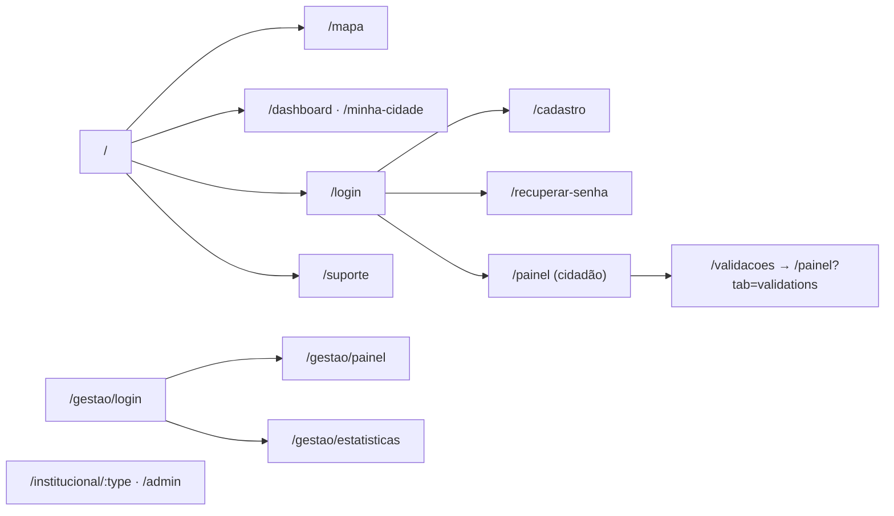

# 6. Documentação Técnica do Frontend

## 6.1 Stack

- **React 18** + **TypeScript** + **Vite 5** (`@vitejs/plugin-react-swc`).
- **React Router** (rotas) + **TanStack Query** (estado de servidor).
- **Tailwind CSS** + **shadcn/ui** (Radix UI) + **lucide-react** + **framer-motion**.
- **Leaflet / react-leaflet / leaflet.heat** (mapa e heatmap).
- **react-hook-form** + **zod** (formulários/validação).
- **Recharts** (gráficos), **react-helmet-async** (SEO).

## 6.2 Estrutura de componentes

| Grupo | Componentes | Papel |
|-------|-------------|-------|
| Mapa | `MapView`, `MapLegend`, `useNeighborhoodBoundaries` | Mapa Leaflet, legenda por status, contorno de bairros |
| Registro/Detalhe | `CreateReportModal`, `ReportDetailModal`, `ReportCard`, `ReportImage` | Fluxo de registro (4 passos), detalhe, listagem |
| Status | `StatusControl`, `StatusBadge`, `PriorityBadge` | Mudança de status/reabertura e selos |
| Layout/navegação | `layout/Navbar`, `NavLink`, `HeroCarousel`, `OnboardingModal`, `Seo` | Casca da aplicação |
| Acesso | `ProtectedRoute` | Guarda de rotas |
| Suporte | `support/ContactForm`, `ContactInfo`, `FaqAccordion`, `SupportFab`, `SupportFooter` | Suporte/FAQ |
| Robustez | `ErrorBoundary` | Captura de erros de render |
| **UI base** | `components/ui/*` | **Reutilizáveis** (shadcn/ui sobre Radix): button, dialog, select, table, tabs, toast, etc. |

Os componentes em `components/ui/` são a **biblioteca reutilizável** (design system) e não contêm
regra de negócio.

## 6.3 Mapa de navegação / rotas

Definidas em `src/App.tsx`:

| Rota | Página | Acesso |
|------|--------|--------|
| `/` | `Index` (landing) | Público |
| `/mapa` | `MapPage` | Público |
| `/dashboard`, `/minha-cidade` | `Dashboard` | Público |
| `/login`, `/cadastro`, `/recuperar-senha` | `Login`/`Register`/`ForgotPassword` | Público |
| `/painel` | `CitizenPanel` | Autenticado |
| `/validacoes` | → redireciona para `/painel?tab=validations` | Autenticado |
| `/institucional/:type`, `/admin` | `InstitutionalPanel`/`AdminPanel` | Institucional |
| `/gestao/login` | `GestaoLogin` | Público |
| `/gestao` | `Gestao` | Público (entrada) |
| `/gestao/painel`, `/gestao/estatisticas` | `GestaoPanel`/`GestaoEstatisticas` | Institucional |
| `/suporte` | `Support` | Público |
| `*` | `NotFound` | — |

## 6.4 Gestão de estado e fluxo de dados

- **Estado de servidor:** **TanStack Query** é a fonte. Hooks por domínio
  (`useOccurrences`, `useTaxonomy`, `useStats`, `useNeighborhoodBoundaries`,
  `useSupportContact`) encapsulam `useQuery`/`useMutation` e entregam um **shape estável** à UI.
- **Mapeamento contrato → UI:** `mapOccurrenceToReport` converte `BackendOccurrence` em `Report`;
  `useOccurrences` enriquece com nome do bairro (taxonomia) e órgão derivado.
- **Invalidação:** mutações de status/reabertura invalidam `occurrences`, `occurrence-detail`,
  `status-history` e os recortes `analytics-*` (`useOccurrences.ts:53`).
- **Estado de autenticação:** Context `AuthProvider`/`useAuth` (usuário, papéis, órgão) sincronizado
  entre abas via evento `storage`.
- **Estado de UI local:** `useState` nos formulários (ex.: `CreateReportModal` controla passo,
  posição, arquivos) e `useTheme` para tema claro/escuro.

## 6.5 Integração com a API (cliente)

- **Centralizada** em `src/lib/api.ts` (ver [05-backend-contrato.md](05-backend-contrato.md)).
- **Tratamento de erro:** `ApiError` com `status`/`data`. Padrões na UI:
  - **409 duplicidade** → toast "Ocorrência semelhante já existe" (`CreateReportModal`).
  - **409 transição inválida** → toast "Transição não permitida" (`StatusControl`).
  - Falha de upload de mídia → ocorrência preservada, aviso para reenviar.
- **Auth no cliente:** Bearer + refresh automático; tokens em `localStorage`
  (`zup_access_token`/`zup_refresh_token`).

## 6.6 Camada de mapa (Leaflet/OSM)

- **Tiles:** OSM público (`OSM_URL` em `MapView.tsx:85`; URL equivalente em `Dashboard.tsx:65`).
  > ⚠️ A confirmar: **trocar o provedor de tiles antes de produção** (política de uso do OSM).
- **Camadas:** marcadores de ocorrências (cor por status, `getStatusColor`), **contorno de bairros**
  (GeoJSON real via `useNeighborhoodBoundaries`) e **heatmap** (`leaflet.heat` no `Dashboard`).
- **Raio de proximidade no registro:** ao marcar o ponto, busca `nearby` (500 m) e mostra
  ocorrências próximas + aviso de duplicidade (7 m). Bairro detectado por `/neighborhoods/locate`.
- **CSS vendorizado:** `src/vendor/leaflet/leaflet.css` (cópia oficial) para evitar dependência de
  CDN.

## 6.7 Identidade visual

- **Paleta:** branco + **tons de roxo**. Cor primária `--primary: 262 60% 45%` (HSL) no tema claro
  e `262 60% 55%` no escuro (`src/index.css`). Acentos por órgão em `organConfig.ts`
  (Prefeitura roxo, VISAN azul, CELESC âmbar).
- **Tipografia/UI:** componentes shadcn/ui (Radix) com Tailwind; ícones `lucide-react`; animações
  `framer-motion`.
- **Tema claro/escuro:** `useTheme` + `next-themes`.
- **Cores de status:** mapa fixo `STATUS_COLORS` em `mockData.ts:193` (ex.: validada=roxo,
  em execução=teal, resolvido=verde, rejeitada=vermelho).

## 6.8 Validação no cliente

`src/lib/validators.ts`: `validateCPF` (dígitos verificadores), `formatCPF`, `validateCEP`,
`formatCEP`, `validatePhone`, `formatPhone`. Formulários usam **react-hook-form + zod**.
