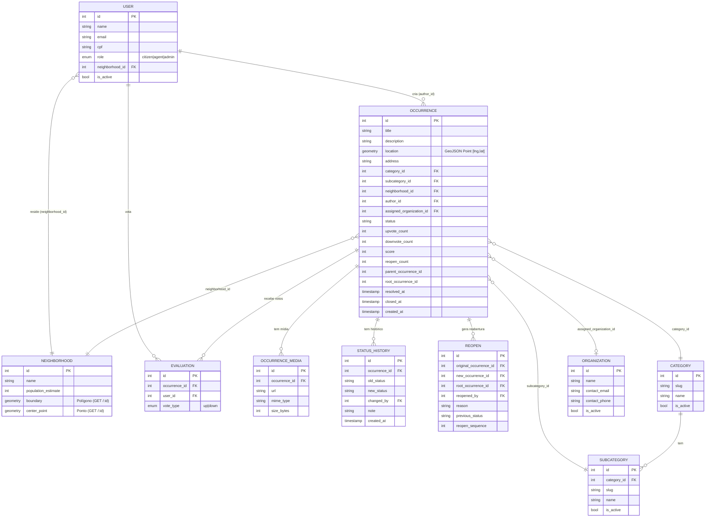

# 7. Modelo de Dados (contrato consumido)

> Este é o **frontend**: não possui banco. O modelo abaixo é o **contrato** que o front consome do
> backend ProjetoZup (PostgreSQL + PostGIS), reconstruído a partir das interfaces TypeScript em
> `src/lib/*-api.ts`. O esquema físico (tabelas, índices, constraints) é definido **no backend** —
> trate este ER como a **visão de domínio** que o front enxerga.

## 7.1 Diagrama ER (visão do contrato)

## 7.2 Entidades centrais (como o front as consome)

| Entidade | Interface (front) | Observações |
|----------|-------------------|-------------|
| Ocorrência | `BackendOccurrence` (`occurrences-api.ts`) | `location` é GeoJSON Point `[lng, lat]`; `status` é um dos 9 enums; ids são **inteiros** |
| Mídia | `OccurrenceMedia` | `url` pode ser relativa → prefixada com a origem do backend |
| Histórico de status | `BackendStatusHistory` | `old_status`/`new_status`, `changed_by`, `note` |
| Reabertura | `BackendReopen` | Encadeamento por `root_occurrence_id`/`reopen_sequence` |
| Avaliação (voto) | `Evaluation` | `vote_type: up\|down` |
| Categoria/Subcategoria | `BackendCategory`/`BackendSubcategory` | `id` numérico + `slug` |
| Bairro | `NeighborhoodSummary`/`NeighborhoodDetail` | Geometria (`boundary`, `center_point`) **só** no detalhe |
| Órgão | `BackendOrganization` | Somente leitura; referenciado por `assigned_organization_id` |
| Usuário | `BackendUser` | `role: citizen\|agent\|admin`, `neighborhood_id` |

**Modelo de UI (`Report`).** O front converte `BackendOccurrence` → `Report` (`mockData.ts`),
adicionando rótulos, cores, nome do bairro e órgão derivado. `Report.priority` é **sempre `media`**
(o backend não tem prioridade hoje).

## 7.3 Decisões geoespaciais

- **GeoJSON / SRID.** A localização trafega como **GeoJSON Point**, convenção **`[longitude,
  latitude]`**. O front mapeia `coordinates[1]→lat` e `coordinates[0]→lng` (`occurrences-api.ts:103`).
- **Geofencing.** `GET /neighborhoods/locate?lat&lng` resolve o bairro que **contém** o ponto
  (`ST_Contains`, no backend).
- **Geometria de bairros.** `boundary` (polígono) e `center_point` vêm em GeoJSON via
  `ST_AsGeoJSON` **apenas** no `GET /neighborhoods/:id`. O front monta a malha desenhável com N+1
  controlado (`listNeighborhoodBoundaries`).
- **Proximidade/duplicidade.** `GET /occurrences/nearby` (raio em metros) e bloqueio na criação
  (409) — cálculo de distância (`ST_DWithin`/`geography`) **no backend**.
- **Heatmap.** `GET /analytics/heatmap` devolve `{ lat, lng, weight }` já prontos para `leaflet.heat`.

> ⚠️ A confirmar (decisões de banco, lado backend): **SRID** efetivo e reprojeção (ex.: **SIRGAS
> 2000 → WGS84**), uso de `geometry` vs. `geography`, índices espaciais (GiST), e geração do ponto
> central (`ST_PointOnSurface` vs. `ST_Centroid`). Não são visíveis no contrato consumido pelo
> front — documentar no repositório do backend.

## 7.4 Integridade referencial

- A ocorrência referencia `category_id`, `subcategory_id`, `neighborhood_id`,
  `assigned_organization_id` (nulo até a triagem) e `author_id`.
- O front **tolera nulos** nessas FKs (campos opcionais em `Report`; bairro/órgão caem em vazio /
  "Não atribuído").

> ⚠️ A confirmar (lado backend): comportamento de FKs sensíveis — em especial **`ON DELETE SET
> NULL` em `neighborhood_id`** — e a recomendação de que **reimportações da malha de bairros sejam
> aditivas** para não desvincular ocorrências existentes (ver RN-14).
