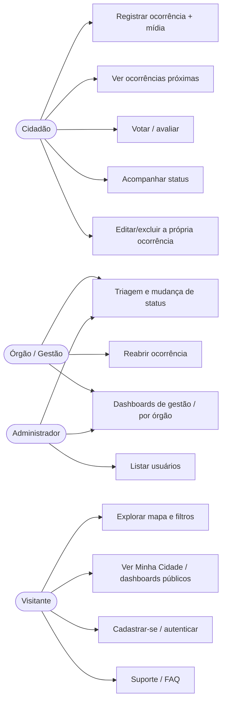
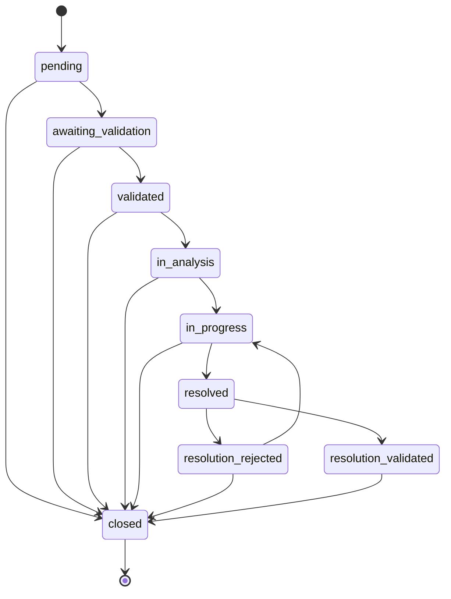
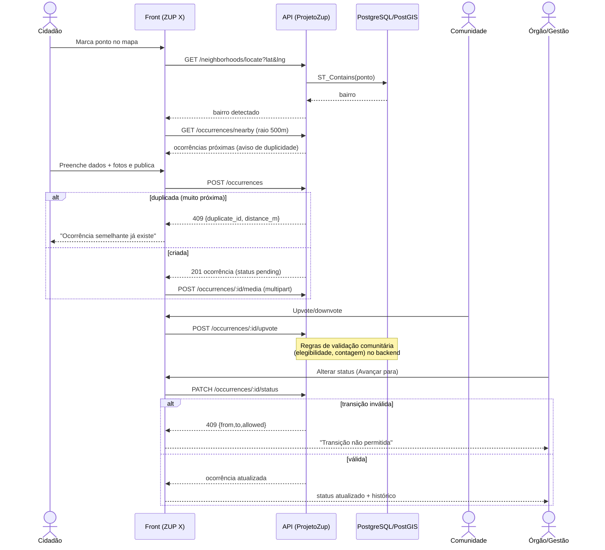
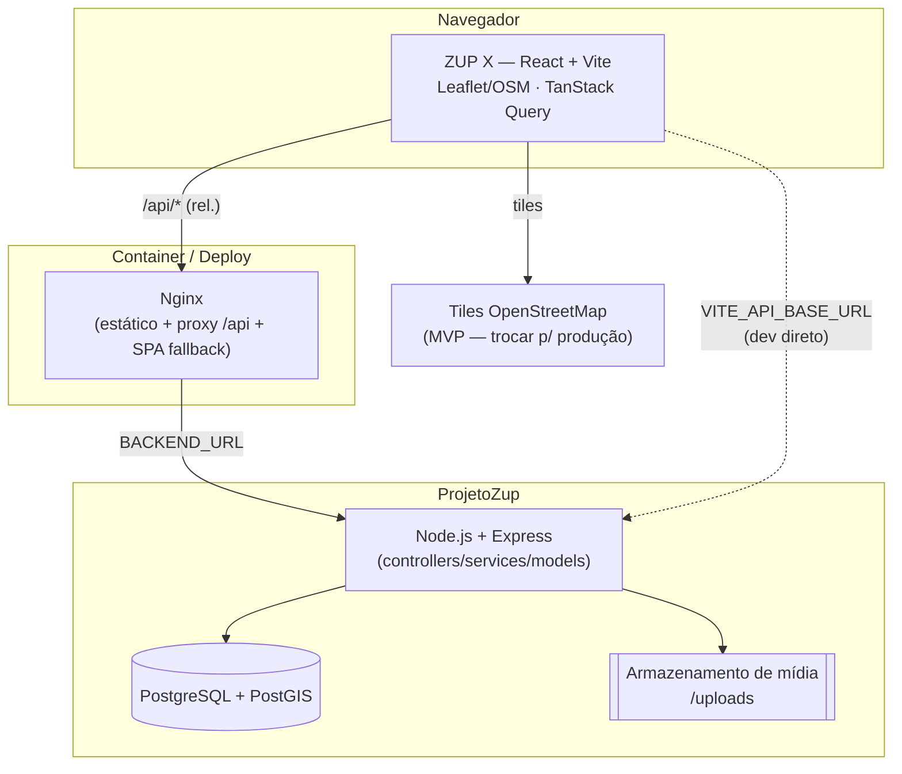

# 8. Diagramas (consolidados)

Diagramas em Mermaid, referenciados pelas demais seções.

## 8.1 Casos de uso (atores × funcionalidades)

## 8.2 Modelo ER

Ver [07-modelo-de-dados.md](07-modelo-de-dados.md#71-diagrama-er-visão-do-contrato).

## 8.3 Máquina de estados da ocorrência

Ver detalhe e transições em
[01-regras-de-negocio.md](01-regras-de-negocio.md#diagrama-de-estados).

## 8.4 Sequência — registrar → validação comunitária → mudança de status

## 8.5 Arquitetura geral

> No **desenvolvimento**, o front fala direto com a API por `VITE_API_BASE_URL`. No **container**, o
> bundle chama `/api` (relativo) e o **Nginx** faz proxy para `BACKEND_URL` (sem CORS, com fallback
> de SPA). Ver [09-como-rodar.md](09-como-rodar.md).
